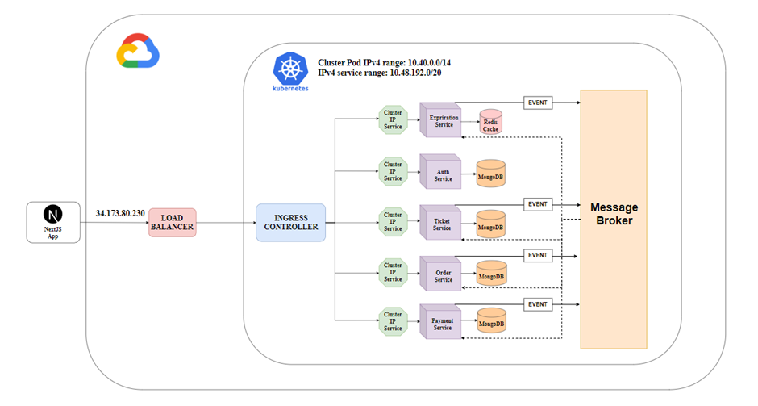

###### this is from Github
# Ticket selling app

Đây là repository của ứng dụng microservices Ticket selling. Mục đích là demo các tính năng của Kubernetes phục vụ đồ án môn học Quản trị mạng và hệ thống.

Thành viên nhóm:
- Bùi Thị Ngọc Trăm - 22521497
- Nguyễn Quốc An - 22520023
- Nguyễn Đức Khang - 22520618

## Kiến trúc hệ thống

Ứng dụng microservices bao gồm các service:
- Auth-Service: Thực hiện những chức năng liên quan đến xác thực người dùng.
- Ticket-Service: Tạo vé mới và trả về danh sách vé cho người dùng.
- Order-Service: Theo dõi và xử lý đơn hàng khi người dùng đặt vé.
- Payment-Service: Thực hiện chức năng thanh toán.
- Expriration-Service: Khi một đơn hàng được tạo ra sẽ được đưa vào hàng đợi và sau 1 phút nếu đơn hàng chưa được thanh toán sẽ tạo sự kiện cho biết đơn hàng hết hạn.
- Các dịch vụ tương tác với nhau qua Message Broker (NATS Streaming Server).

## Công nghệ sử dụng

- Docker: Đóng gói, tạo image của các service.
- Google Kubernetes Engine (GKE): Dịch vụ Kubernetes được cung cấp bởi Google Cloud Platform.
- Google Container Registry: Dịch vụ lưu trữ Image.
- NATS Streaming Server: Đóng vai trò Message Broker cho các service.
- Javascript, Typescript, NextJS: Ngôn ngữ và framework hỗ trợ tạo ứng dụng web.
- MongoDB: Cơ sở dữ liệu.

## Kịch bản demo

- Chạy ứng dụng web để kiểm tra khả năng phát hiện và xác định vị trí của các dịch vụ trong một môi trường phân tán.
- Xóa pod để kiểm tra khả năng phục hồi.
- Xóa pod để kiểm tra khả năng lưu dữ liệu sau khi gán volume cho pod.
